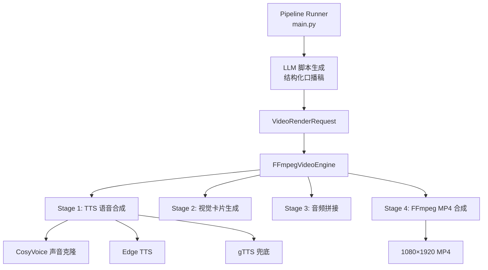

# UCO 视频引擎 — 功能总结与文档更新

> Phase 3.5 ✅ 已完成 | 2026-04-11

---

## 已更新的文档 (4 个文件)

| 文件 | 更新内容 |
|------|---------|
| [INDEX.md](file:///Users/lillianliao/notion_rag/universal_content_orchestrator/docs/INDEX.md) | 新增 ROADMAP 到首读列表，更新各文档描述 |
| [FEATURES.md](file:///Users/lillianliao/notion_rag/universal_content_orchestrator/docs/FEATURES.md) | 完整视频能力清单 + 开源技术栈对照表 |
| [ARCHITECTURE.md](file:///Users/lillianliao/notion_rag/universal_content_orchestrator/docs/ARCHITECTURE.md) | 目录树、4 阶段渲染管线、CosyVoice 逐段注册策略、数据流图 |
| [ROADMAP.md](file:///Users/lillianliao/notion_rag/universal_content_orchestrator/docs/ROADMAP.md) | Phase 3.5 ✅ 完成标记 + Phase 3.6 规划 |

---

## 已实现功能一览

### 1. 模块化视频渲染引擎



### 2. 三级 TTS 提供商体系

| 级别 | 提供商 | 特点 | 声音克隆 |
|------|--------|------|---------|
| **Tier 1** | CosyVoice v3.5-plus | Lilian 本人声音 | ✅ 16s 参考音频 |
| **Tier 2** | Edge TTS | 免费高质量中英文 | ❌ 预设声音 |
| **Tier 3** | gTTS | 免费兜底 | ❌ 预设声音 |

### 3. 高端视觉效果

- 渐变背景（深蓝→紫色）
- 毛玻璃质感面板
- 双面板卡片设计（关键词高亮 + 正文）
- 自动进度条
- 品牌 Badge + 来源标签

### 4. CosyVoice「逐段注册」策略

```text
问题: DashScope 免费 Tier 克隆声音在注册后秒级变为 UNDEPLOYED (418 错误)
解决: 每段口播文本独立执行「注册新 voice_id → 立即合成」原子操作
效果: 3 段视频全部使用 Lilian 本人声音成功合成
```

---

## 开源项目集成方式

| 组件 | 开源项目 | 集成方式 |
|------|---------|---------|
| 视频编码 | FFmpeg (`ffmpeg-python`) | Python 绑定，构建 filter graph → 系统调用 `~/bin/ffmpeg` |
| 图像渲染 | Pillow (PIL) | 直接 API 调用，`ImageDraw` 绘制渐变/面板/文字 |
| TTS | edge-tts | async Python API，微软 Edge 在线 TTS |
| TTS 兜底 | gTTS | Google Translate TTS，纯 HTTP |
| 声音克隆 | DashScope SDK (`dashscope`) | WebSocket + REST API → CosyVoice v3.5-plus |
| 文件上传 | tmpfiles.org | HTTP POST → 临时公开 URL (DashScope 需要 URL 格式的参考音频) |
| LLM | 通义千问 Qwen | DashScope HTTP API → 内容筛选 + 脚本生成 |

---

## 关键文件变更

| 文件 | 变更类型 |
|------|---------|
| [cosyvoice_provider.py](file:///Users/lillianliao/notion_rag/universal_content_orchestrator/src/core/video_engine/tts_providers/cosyvoice_provider.py) | 新增：CosyVoice 声音克隆 TTS 提供商 |
| [ffmpeg_engine.py](file:///Users/lillianliao/notion_rag/universal_content_orchestrator/src/core/video_engine/ffmpeg_engine.py) | 重构：双面板卡片 + concat 管线 + TTS 降级 |
| [base_engine.py](file:///Users/lillianliao/notion_rag/universal_content_orchestrator/src/core/video_engine/base_engine.py) | 增强：`reference_audio` 字段 + `ScriptSegment` 模型 |
| [video_engines.yaml](file:///Users/lillianliao/notion_rag/universal_content_orchestrator/config/video_engines.yaml) | 更新：CosyVoice 配置 |

## 声音资产

| 文件 | 用途 |
|------|------|
| `data/voices/lilian_reference.m4a` | 参考音频原始文件 (16.4s) |
| `data/voices/lilian_reference.wav` | FFmpeg 转换后的 16kHz mono WAV |
| `data/voices/cosyvoice_voice_id.json` | 缓存的 voice_id (每次渲染会重新注册) |
